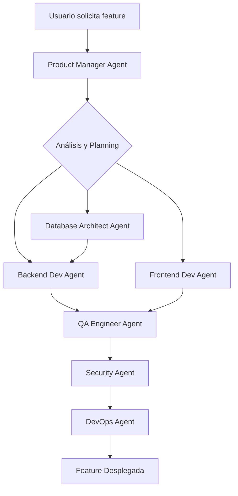

# Arquitectura Multi-Agente para LTI - Sistema de Seguimiento de Talento

## Visión General

Esta arquitectura implementa un sistema multi-agente basado en los principios de Anthropic, donde múltiples agentes especializados colaboran en el ciclo de vida del desarrollo del producto digital.

## Principios de Diseño

1. **Jerarquía Clara**: Product Manager Agent actúa como coordinador principal
2. **Especialización**: Cada agente tiene un dominio específico de expertise
3. **Paralelización**: Los agentes pueden trabajar en paralelo cuando no hay dependencias
4. **Comunicación Estructurada**: Protocolos claros de intercambio de información
5. **Verificación Continua**: QA y Security agents validan el trabajo continuamente

## Agentes del Sistema

### 1. Product Manager Agent (Coordinador Principal)
**Rol**: Orquesta el desarrollo del producto completo
**Responsabilidades**:
- Analizar requisitos del usuario
- Crear historias de usuario y criterios de aceptación
- Asignar tareas a otros agentes
- Coordinar dependencias entre agentes
- Generar reportes de progreso

**Herramientas**:
- Análisis de requisitos
- Generación de especificaciones técnicas
- Gestión de backlog
- Priorización de features

### 2. Backend Developer Agent
**Rol**: Desarrolla la lógica del servidor y APIs
**Responsabilidades**:
- Implementar endpoints REST
- Crear modelos de datos con Prisma
- Implementar lógica de negocio
- Manejar autenticación y autorización
- Optimizar performance del servidor

**Stack**: Express, TypeScript, Prisma, PostgreSQL

### 3. Frontend Developer Agent
**Rol**: Desarrolla la interfaz de usuario
**Responsabilidades**:
- Crear componentes React reutilizables
- Implementar gestión de estado
- Integrar con APIs del backend
- Asegurar responsive design
- Optimizar performance del cliente

**Stack**: React, TypeScript, CSS

### 4. Database Architect Agent
**Rol**: Diseña y optimiza la base de datos
**Responsabilidades**:
- Diseñar esquemas eficientes
- Crear índices para optimización
- Implementar migraciones
- Asegurar integridad de datos
- Planificar escalabilidad

**Stack**: PostgreSQL, Prisma

### 5. DevOps Agent
**Rol**: Gestiona infraestructura y despliegue
**Responsabilidades**:
- Configurar contenedores Docker
- Implementar CI/CD pipelines
- Gestionar variables de entorno
- Monitorear aplicaciones
- Automatizar despliegues

**Stack**: Docker, Docker Compose, GitHub Actions

### 6. QA Engineer Agent
**Rol**: Asegura la calidad del producto
**Responsabilidades**:
- Escribir tests unitarios
- Implementar tests de integración
- Ejecutar tests E2E
- Validar criterios de aceptación
- Reportar y trackear bugs

**Stack**: Jest, React Testing Library, Supertest

### 7. Security Agent
**Rol**: Asegura la seguridad de la aplicación
**Responsabilidades**:
- Auditar código por vulnerabilidades
- Implementar mejores prácticas de seguridad
- Gestionar secretos y credenciales
- Configurar políticas de seguridad
- Realizar penetration testing

**Stack**: OWASP guidelines, Security headers

## Flujos de Trabajo

### Flujo de Desarrollo de Feature



### Protocolo de Comunicación

```json
{
  "message_type": "TASK_ASSIGNMENT",
  "from_agent": "product-manager",
  "to_agent": "backend-dev",
  "task": {
    "id": "TASK-001",
    "type": "API_ENDPOINT",
    "description": "Crear endpoint CRUD para gestión de usuarios",
    "requirements": {
      "endpoints": [
        "GET /api/users",
        "POST /api/users",
        "PUT /api/users/:id",
        "DELETE /api/users/:id"
      ],
      "validation": "Email único, nombre requerido",
      "authentication": "JWT required"
    },
    "priority": "HIGH",
    "deadline": "2024-01-20"
  }
}
```

## Implementación Técnica

### Estructura Base de un Agente

```typescript
interface Agent {
  id: string;
  name: string;
  role: string;
  capabilities: string[];
  
  // Métodos principales
  analyzeTask(task: Task): Analysis;
  planExecution(analysis: Analysis): ExecutionPlan;
  executeTask(plan: ExecutionPlan): TaskResult;
  validateResult(result: TaskResult): ValidationReport;
  communicateResult(result: TaskResult, to: Agent): void;
}

interface Task {
  id: string;
  type: TaskType;
  description: string;
  requirements: Record<string, any>;
  dependencies: string[];
  priority: Priority;
  deadline?: Date;
}

interface TaskResult {
  taskId: string;
  status: 'completed' | 'failed' | 'partial';
  output: any;
  errors?: Error[];
  nextSteps?: string[];
}
```

### Coordinación Multi-Agente

```typescript
class MultiAgentCoordinator {
  private agents: Map<string, Agent> = new Map();
  private taskQueue: PriorityQueue<Task> = new PriorityQueue();
  private runningTasks: Map<string, RunningTask> = new Map();
  
  async processUserRequest(request: UserRequest): Promise<ProjectResult> {
    // 1. Product Manager analiza el request
    const analysis = await this.agents.get('product-manager').analyze(request);
    
    // 2. Crea plan de ejecución con tareas paralelas
    const executionPlan = this.createExecutionPlan(analysis);
    
    // 3. Distribuye tareas a agentes especializados
    const results = await this.executeInParallel(executionPlan);
    
    // 4. Validación por QA y Security
    const validation = await this.validateResults(results);
    
    // 5. Deploy si pasa validación
    if (validation.passed) {
      return await this.deploy(results);
    }
    
    return { status: 'failed', errors: validation.errors };
  }
}
```

## Optimización y Performance

### Paralelización de Tareas

- **Frontend y Backend** pueden desarrollarse en paralelo si las interfaces están bien definidas
- **Database design** debe completarse antes que el backend implementation
- **Testing** puede comenzar tan pronto como haya código para probar
- **Security audits** se ejecutan continuamente, no al final

### Gestión de Tokens

Siguiendo las mejores prácticas de Anthropic:
- Agente coordinador usa modelo más potente (ej: Claude Opus)
- Sub-agentes usan modelos más eficientes (ej: Claude Sonnet)
- Cacheo agresivo de resultados intermedios
- Límites de tokens por tarea para controlar costos

## Monitoreo y Observabilidad

```typescript
interface AgentMetrics {
  agentId: string;
  tasksCompleted: number;
  averageCompletionTime: number;
  successRate: number;
  tokenUsage: {
    input: number;
    output: number;
    total: number;
  };
  errors: AgentError[];
}

class AgentMonitor {
  trackExecution(agent: Agent, task: Task): ExecutionTracker;
  getMetrics(agentId: string): AgentMetrics;
  alertOnFailure(threshold: number): void;
}
```

## Casos de Uso

### 1. Desarrollo de Feature Completa
```
Usuario: "Necesito agregar un sistema de roles y permisos"

Flujo:
1. PM Agent crea especificaciones
2. DB Agent diseña tablas de roles/permisos
3. Backend Agent implementa middleware de autorización
4. Frontend Agent crea UI de gestión de roles
5. QA Agent escribe y ejecuta tests
6. Security Agent valida implementación
7. DevOps Agent despliega cambios
```

### 2. Bug Fix Crítico
```
Usuario: "Hay una vulnerabilidad SQL injection en el endpoint de búsqueda"

Flujo:
1. Security Agent analiza y confirma vulnerabilidad
2. Backend Agent implementa fix usando Prisma prepared statements
3. QA Agent crea tests de regresión
4. DevOps Agent hace hotfix deployment
```

### 3. Optimización de Performance
```
Usuario: "La página de listado de usuarios es muy lenta"

Flujo:
1. DevOps Agent analiza métricas
2. DB Agent sugiere índices
3. Backend Agent implementa paginación
4. Frontend Agent añade lazy loading
5. QA Agent valida mejoras
```

## Mejores Prácticas

1. **Comunicación Clara**: Cada agente debe documentar sus decisiones
2. **Fallos Graceful**: Si un agente falla, otros deben poder continuar
3. **Rollback Capability**: Siempre mantener versión anterior funcional
4. **Logs Estructurados**: Facilitar debugging de interacciones multi-agente
5. **Límites de Tiempo**: Timeout para evitar agentes bloqueados

## Evolución Futura

- **Agentes Asíncronos**: Permitir que agentes creen sub-agentes dinámicamente
- **Aprendizaje Continuo**: Agentes que mejoran basándose en feedback
- **Auto-escalado**: Crear múltiples instancias de agentes bajo alta demanda
- **Integración Externa**: Conectar con herramientas como Jira, GitHub, Slack