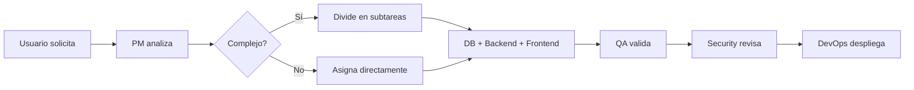

# 🚀 Guía Práctica de Uso de Agentes LTI

## 📋 Índice
1. [Resumen Rápido](#resumen-rápido)
2. [Cómo Activar los Agentes](#cómo-activar-los-agentes)
3. [Casos de Uso Cotidianos](#casos-de-uso-cotidianos)
4. [Comandos Esenciales](#comandos-esenciales)
5. [Flujos de Trabajo](#flujos-de-trabajo)
6. [Troubleshooting](#troubleshooting)
7. [Tips y Mejores Prácticas](#tips-y-mejores-prácticas)

## 🎯 Resumen Rápido

### ¿Qué son los Agentes?
Los agentes son asistentes especializados de IA que automatizan tareas específicas del desarrollo de software. Cada agente es experto en su área y puede trabajar de forma independiente o colaborativa.

### Agentes Disponibles
| Agente | Especialidad | Cuándo Usarlo |
|--------|--------------|---------------|
| **Product Manager** | Planificación y coordinación | Nuevas features, bugs, análisis |
| **Backend Dev** | APIs y lógica del servidor | Endpoints, base de datos, autenticación |
| **Frontend Dev** | Interfaces de usuario | Componentes React, UX, integración |
| **Database Architect** | Diseño de BD | Esquemas, optimización, migraciones |
| **DevOps** | Infraestructura | Docker, CI/CD, despliegues |
| **QA Engineer** | Testing | Tests automatizados, validación |
| **Security** | Seguridad | Auditorías, vulnerabilidades |

## 🔧 Cómo Activar los Agentes

### Opción 1: Comando Directo (Recomendado)
```bash
# Para solicitar una nueva feature
claude-agent pm "Necesito agregar un sistema de notificaciones por email"

# Para desarrollo backend específico
claude-agent backend "Crear endpoint para exportar talentos a CSV"

# Para UI/UX
claude-agent frontend "Diseñar un dashboard de métricas de talento"
```

### Opción 2: Modo Interactivo
```bash
# Iniciar sesión interactiva
claude-agent interactive

# El sistema te preguntará:
> ¿Qué necesitas hacer hoy?
> Selecciona el tipo de tarea:
> 1. Nueva funcionalidad
> 2. Corregir bug
> 3. Optimización
> 4. Documentación
```

### Opción 3: Natural Language
Simplemente describe lo que necesitas en lenguaje natural:
```
"Tengo un problema: los usuarios reportan que la búsqueda de talentos es muy lenta
y a veces no encuentra resultados. Necesito que se arregle para mañana."
```

El sistema automáticamente:
1. PM Agent analiza el problema
2. Asigna a Backend y DB Agents para optimización
3. QA Agent prepara tests de rendimiento
4. DevOps Agent planifica el despliegue

## 💼 Casos de Uso Cotidianos

### 1. 🆕 Agregar Nueva Funcionalidad

**Situación**: "Necesito que los reclutadores puedan programar entrevistas con candidatos"

**Comando**:
```bash
claude-agent pm feature "Sistema de programación de entrevistas con calendario integrado"
```

**Qué sucede**:
```
PM Agent:
├─ Analiza requisitos
├─ Crea user stories
└─ Distribuye tareas:
   ├─ DB Agent: Diseña tablas (interviews, availability)
   ├─ Backend Agent: 
   │  ├─ CRUD endpoints para entrevistas
   │  └─ Integración con Google Calendar
   ├─ Frontend Agent:
   │  ├─ Componente calendario
   │  └─ Formulario de programación
   └─ QA Agent: Tests E2E del flujo completo
```

### 2. 🐛 Corregir Bug Crítico

**Situación**: "ERROR: Los usuarios no pueden loguearse, sale error 500"

**Comando**:
```bash
claude-agent fix critical "Login devuelve error 500"
```

**Respuesta Inmediata**:
```
🚨 MODO EMERGENCIA ACTIVADO

Security Agent → Analiza logs (2 min)
└─ Detectado: Token JWT expirado en producción

Backend Agent → Implementa hotfix (5 min)
├─ Actualiza configuración JWT
└─ Agrega fallback para tokens antiguos

QA Agent → Valida fix (3 min)
└─ ✅ Login funcionando

DevOps Agent → Despliega (2 min)
└─ 🟢 Hotfix en producción

Tiempo total: 12 minutos
```

### 3. 🎨 Mejorar UI/UX

**Situación**: "La página de listado de talentos se ve muy apretada en móvil"

**Comando**:
```bash
claude-agent frontend responsive "Mejorar vista móvil de lista talentos"
```

**Proceso**:
```
Frontend Agent:
├─ Analiza componente actual
├─ Propone 3 diseños responsivos
├─ Implementa el aprobado:
│  ├─ Cards apiladas en móvil
│  ├─ Información prioritaria visible
│  └─ Menú hamburguesa
└─ Optimiza performance móvil
```

### 4. 🚀 Optimización de Performance

**Situación**: "El dashboard tarda 5 segundos en cargar"

**Comando**:
```bash
claude-agent optimize "Dashboard loading 5 seconds"
```

**Análisis Multi-Agente**:
```
DevOps Agent:
└─ Métricas: 3s backend, 2s frontend

Backend Agent:
├─ Implementa paginación
├─ Añade índices faltantes
└─ Cache Redis para queries pesadas

Frontend Agent:
├─ Lazy loading de componentes
├─ Virtualized lists
└─ Optimiza bundle size

Resultado: 0.8s tiempo de carga 🎯
```

### 5. 📊 Generar Reportes

**Situación**: "Necesito un reporte semanal de nuevos talentos por skill"

**Comando**:
```bash
claude-agent pm report "Weekly talent report by skills"
```

**Implementación Coordinada**:
```
1. DB Agent → Crea vistas optimizadas
2. Backend Agent → Endpoint /api/reports/weekly-talents
3. Frontend Agent → Componente de visualización
4. DevOps Agent → Cron job para envío automático
```

## 🎮 Comandos Esenciales

### Comandos Básicos
```bash
# Ver estado de todos los agentes
claude-agent status

# Listar tareas en progreso
claude-agent tasks --in-progress

# Ver historial de cambios
claude-agent history --last 10

# Cancelar tarea
claude-agent cancel TASK-001
```

### Comandos PM Agent
```bash
# Crear roadmap
claude-agent pm roadmap --quarter Q1-2024

# Priorizar backlog
claude-agent pm prioritize --method RICE

# Estimar esfuerzo
claude-agent pm estimate "New feature description"

# Generar especificaciones
claude-agent pm spec "Feature name" --detailed
```

### Comandos Backend Agent
```bash
# Generar CRUD completo
claude-agent backend crud --model Evaluation

# Crear migración
claude-agent backend migrate "Add status to talents"

# Optimizar queries
claude-agent backend optimize --analyze-n+1

# Generar documentación API
claude-agent backend docs --swagger
```

### Comandos Frontend Agent
```bash
# Crear componente
claude-agent frontend component TalentCard --with-tests

# Generar página completa
claude-agent frontend page TalentDashboard

# Analizar accesibilidad
claude-agent frontend audit --a11y

# Optimizar bundle
claude-agent frontend optimize --analyze-bundle
```

### Comandos DevOps Agent
```bash
# Desplegar a staging
claude-agent devops deploy staging

# Revisar logs
claude-agent devops logs --tail 100 --errors

# Escalar servicio
claude-agent devops scale --replicas 3

# Backup base de datos
claude-agent devops backup --database
```

## 🔄 Flujos de Trabajo

### Flujo 1: Nueva Feature Completa


**Ejemplo Práctico**:
```bash
# 1. Solicitas la feature
$ claude-agent new "Sistema de evaluación 360 grados"

# 2. PM Agent responde
> Analizando... Feature compleja detectada
> Tiempo estimado: 3 días
> Subtareas creadas: 12
> 
> ¿Proceder? (y/n): y

# 3. Ves progreso en tiempo real
> [DB Agent] Creando esquema evaluaciones... ✅
> [Backend] Implementando endpoints... 🔄 45%
> [Frontend] Diseñando formularios... ⏳ Esperando API
```

### Flujo 2: Debugging Colaborativo
```bash
# 1. Reportas el problema
$ claude-agent debug "Usuarios duplicados en búsqueda"

# 2. Agentes colaboran
> [QA] Reproduciendo issue... ✅ Confirmado
> [Backend] Analizando queries... 
>   └─ Encontrado: JOIN sin DISTINCT
> [Backend] Aplicando fix...
> [QA] Validando fix... ✅ 
> [Security] Revisando impacto... ✅ Sin riesgos

# 3. Fix aplicado
> Fix completado en 8 minutos
> ¿Desplegar a producción? (y/n): 
```

### Flujo 3: Refactoring Seguro
```bash
# 1. Solicitas refactoring
$ claude-agent refactor "Modernizar autenticación a JWT"

# 2. Plan de migración
> [PM] Plan de migración en 4 fases:
>   Fase 1: Nuevo sistema en paralelo
>   Fase 2: Migración gradual (10% usuarios)
>   Fase 3: Migración completa
>   Fase 4: Limpieza código legacy
> 
> [Backend] Iniciando Fase 1...
```

## 🔍 Troubleshooting

### Problema: "Agente no responde"
```bash
# Verificar estado
claude-agent health-check

# Reiniciar agente específico
claude-agent restart backend

# Ver logs del agente
claude-agent logs backend --debug
```

### Problema: "Conflicto entre agentes"
```bash
# Ver dependencias
claude-agent deps TASK-001

# Resolver conflicto manual
claude-agent resolve-conflict TASK-001 TASK-002

# Forzar prioridad
claude-agent priority TASK-001 --high
```

### Problema: "Tarea bloqueada"
```bash
# Ver qué bloquea
claude-agent blockers TASK-001

# Saltear blocker (con cuidado)
claude-agent force TASK-001 --skip-deps

# Reasignar a otro agente
claude-agent reassign TASK-001 --to frontend-2
```

## 💡 Tips y Mejores Prácticas

### 1. Sé Específico
❌ **Malo**: "Mejorar performance"
✅ **Bueno**: "Reducir tiempo de carga del dashboard de 5s a menos de 1s"

### 2. Proporciona Contexto
❌ **Malo**: "Agregar botón"
✅ **Bueno**: "Agregar botón 'Exportar a PDF' en la tabla de talentos, junto a 'Exportar CSV'"

### 3. Usa Prioridades
```bash
# Alta prioridad (se atiende inmediato)
claude-agent pm "Bug: usuarios no pueden loguearse" --priority critical

# Prioridad normal
claude-agent pm "Mejorar colores del tema dark" --priority low
```

### 4. Aprovecha el Modo Batch
```bash
# Múltiples tareas relacionadas
claude-agent batch << EOF
- Agregar campo 'linkedin' a perfil talento
- Permitir importar datos desde LinkedIn
- Mostrar badge de LinkedIn verificado
EOF
```

### 5. Revisa Antes de Deploy
```bash
# Siempre ejecuta antes de producción
claude-agent pre-deploy-check
```

### 6. Usa Templates
```bash
# Crear desde template
claude-agent frontend component --template card UserCard

# Ver templates disponibles
claude-agent templates list
```

### 7. Monitorea Métricas
```bash
# Ver eficiencia de agentes
claude-agent metrics --last-week

# Identificar bottlenecks
claude-agent performance --analyze
```

## 🎯 Comandos Rápidos para Copiar

```bash
# Feature nueva
claude-agent pm feature "Tu descripción aquí"

# Bug urgente
claude-agent fix critical "Descripción del error"

# Optimización
claude-agent optimize "Qué optimizar"

# Crear componente
claude-agent frontend component NombreComponente

# Crear endpoint
claude-agent backend endpoint "POST /api/recurso"

# Deploy staging
claude-agent devops deploy staging

# Ver progreso
claude-agent status --watch
```

## 📚 Recursos Adicionales

- [Arquitectura Completa](./AGENTS_ARCHITECTURE.md)
- [Product Manager Agent](./product-manager/PRODUCT_MANAGER_AGENT.md)
- [Backend Agent](./backend-dev/BACKEND_DEVELOPER_AGENT.md)
- [Frontend Agent](./frontend-dev/FRONTEND_DEVELOPER_AGENT.md)

---

💬 **Soporte**: Si encuentras problemas, usa `claude-agent support "describe tu problema"`